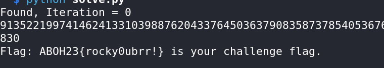

# Small Sage - CTF Challenge Writeup

## Challenge Information
- **Name**: Small Sage
- **Objective**: The objective of the "Small Sage" CTF challenge is to decipher a flag that has been encrypted using RSA encryption techniques, focusing on elements like `n`, `p`, `q`, `C`, `N`, and `e`.

## Solution
To successfully solve the "Small Sage" challenge and retrieve the flag, I followed these steps:

1. **Initial Analysis**:
   - Upon inspecting the provided "Small Sage" script, it was evident that it resembled RSA encryption, as it contained elements like `n`, `p`, and `q`.
   - Additionally, the `out.txt` file contained variables `C`, `N`, and `e`, further indicating an RSA encryption problem.

        

        

2. **Identifying RSA Encryption**:
   - Recognizing the RSA encryption components (`n`, `p`, `q`, `C`, `N`, `e`), it was clear that this challenge was centered around RSA encryption and decryption.

3. **Approach**:
   - Noticing the hint with the term "small" in the challenge name, I hypothesized that it might involve a small `e` problem in RSA encryption.
   - I proceeded to use my typucal script tailored for solving RSA problems with small `e` values.
   - You can find the script in solve.py

4. **Flag Retrieval**:
   - Executing the script designed to handle RSA problems with small `e` values successfully decrypted the encrypted data.
   - The deciphered message revealed the flag: `ABOH23{rocky0ubrr!}`.

        

The resolution of the "Small Sage" challenge involved recognizing RSA encryption elements and leveraging a specialized script to handle the small `e` problem, resulting in the decryption of the encrypted data to obtain the flag.

## Flag
The flag for this challenge is: `ABOH23{rocky0ubrr!}`.

This writeup demonstrates the process of identifying and decrypting an RSA-encrypted flag in the "Small Sage" CTF challenge. Should you require further clarification or have additional questions, please feel free to ask.
